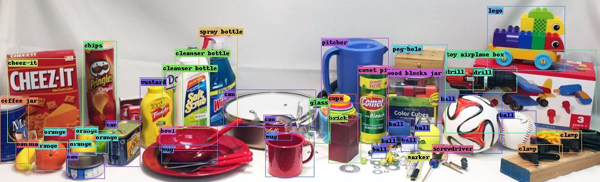

# Detect Every Thing with Few Examples

[](https://arxiv.org/abs/2309.12969) **Accepted at CoRL 2024.**   

[](https://paperswithcode.com/sota/open-vocabulary-object-detection-on-lvis-v1-0?p=detect-every-thing-with-few-examples) [](https://paperswithcode.com/sota/open-vocabulary-object-detection-on-mscoco?p=detect-every-thing-with-few-examples)  [](https://paperswithcode.com/sota/few-shot-object-detection-on-ms-coco-10-shot?p=detect-every-thing-with-few-examples)  [](https://paperswithcode.com/sota/few-shot-object-detection-on-ms-coco-30-shot?p=detect-every-thing-with-few-examples)   [](https://paperswithcode.com/sota/one-shot-object-detection-on-coco?p=detect-every-thing-with-few-examples)


We present DE-ViT, an open-set object detector in this repository.
In contrast to the popular open-vocabulary approach, we follow the few-shot formulation to represent each category with few support images rather than language. Our results shows potential for using images as category representation. 
DE-ViT establishes new state-of-the-art on open-vocabulary, few-shot, and one-shot object detection benchmark with COCO and LVIS.


https://github.com/user-attachments/assets/2aab77f0-73cc-4ddd-a091-2c6fff27eb04


## Installation

```bash
git clone https://github.com/mlzxy/devit.git
conda create -n devit  python=3.9 
conda activate devit
pip install -r devit/requirements.txt
pip install -e ./devit
```

Next, check [Downloads.md](Downloads.md) for instructions to setup datasets and model checkpoints.

## Running Scripts

Download datasets and checkpoints before running scripts.

## Demo



```bash
python3 ./demo/demo.py # will generate demo/output/ycb.out.jpg
```

The notebook [demo/build_prototypes.ipynb](demo/build_prototypes.ipynb) builds prototypes for YCB objects using ViT-L/14 and our provided example images.

## Training

```bash
vit=l task=ovd dataset=coco bash scripts/train.sh  # train open-vocabulary COCO with ViT-L

# task=ovd / fsod / osod
# dataset=coco / lvis / voc
# vit=s / b / l 
# split = 1 / 2 / 3 / 4 for coco one shot, and 1 / 2 / 3 for voc few-shot. 

# few-shot env var `shot = 5 / 10 / 30`
vit=l task=fsod shot=10 bash scripts/train.sh 

# one-shot env var `split = 1 / 2 / 3 / 4`
vit=l task=osod split=1 bash script/train.sh

# detectron2 options can be provided through args, e.g.,
task=ovd dataset=lvis bash scripts/train.sh MODEL.MASK_ON True # train lvis with mask head

# another env var is `num_gpus = 1 / 2 ...`, used to control
# how many gpus are used
```


## Evaluation

All evaluations can be run without training, as long as the checkpoints are downloaded.

The script-level environment variables are the same to training.

```bash
vit=l task=ovd dataset=coco bash scripts/eval.sh # evaluate COCO OVD with ViT-L/14

vit=l task=ovd dataset=lvis bash scripts/eval.sh DE.TOPK 3  MODEL.MASK_ON True  # evaluate LVIS OVD with ViT-L/14

# evaluate Pascal VOC split-3 with ViT-L/14 with 5 shot
vit=l task=fsod dataset=voc split=3 shot=5 bash scripts/eval.sh 
```


## RPN Training

```bash
bash scripts/train_rpn.sh  ARG
# change ARG to ovd / os1 / os2 / os3 / os4 / fs14
# corresponds to open-vocabulary / one-shot splits 1-4 / few-shot

bash scripts/train_rpn.voc.sh  ARG
# change ARG to 1, 2, 3 for split 1/2/3.
```

Check [Tools.md](Tools.md) for intructions to build prototype and prepare weights.


 
## Changes


- Recent updates include the experiments on Pascal VOC. 


- A bug on generalized iou loss is found and fixed, which may cause performance drop compared to the released checkpoint if you retrain it from scratch. 


- A refactored implementation of DeViT is provided at [detectron2/modeling/meta_arch/devit_update.py](detectron2/modeling/meta_arch/devit_update.py) that exactly matches the paper architecture, whose region propagation is implemented at [lib/regionprob_update.py](lib/regionprob_update.py). This implementation actually performs better than the previous one. I remember it gets like 52-53 mAP on COCO open-vocabulary with ViT-L but I lost the checkpoints. It requires more GPU memory and I haven't rertrained it on LVIS yet. You can train it on COCO with the following command: 
   ```bash
   python3 tools/train_net.py    --num-gpus 4  \
            --config-file configs/open-vocabulary/coco/vitl.yaml \
            MODEL.WEIGHTS  weights/initial/open-vocabulary/vitl+rpn.pth \
            DE.OFFLINE_RPN_CONFIG configs/RPN/mask_rcnn_R_50_C4_1x_ovd_FSD.yaml \
            OUTPUT_DIR output/train/open-vocabulary/coco/vitl/ \
            MODEL.META_ARCHITECTURE OpenSetDetectorWithExamples_refactored
   ```


- Drawbacks of this work (since it has been accepted finally so I will just say it here): 
    - It tend to detect objects that do not belong to the prototypes, especially for retailed products that are not presented in the training data. For example, if you have "can", "bottle", and "toy" in the scene, but you only have "can" and "bottle" in the class prototypes.  The ideal performance is to mark "toy" as background, but DE-ViT tends to detect "toy" as either "can" or "bottle". 
      
      
    - The LVIS model has a low AP on the person class, but this does not happen on the model trained on COCO. I think the reason could be LVIS contains so many object classes that overlap with human body. 
      
      
    There sure will be many ways to fix them, using both the class prototypes and low-level spatial features at the same time could be a good starting point. But I am not working on the few-shot object detection task at this moement. 


## Acknowledgement


This repository was built on top of [RegionCLIP](https://github.com/microsoft/RegionCLIP) and [DINOv2](https://github.com/facebookresearch/dinov2). We thank the effort from our community.


## Citation

```
@misc{zhang2024detect,
      title={Detect Everything with Few Examples}, 
      author={Xinyu Zhang and Yuhan Liu and Yuting Wang and Abdeslam Boularias},
      year={2024},
      eprint={2309.12969},
      archivePrefix={arXiv},
      primaryClass={cs.CV},
      url={https://arxiv.org/abs/2309.12969}, 
}
```


