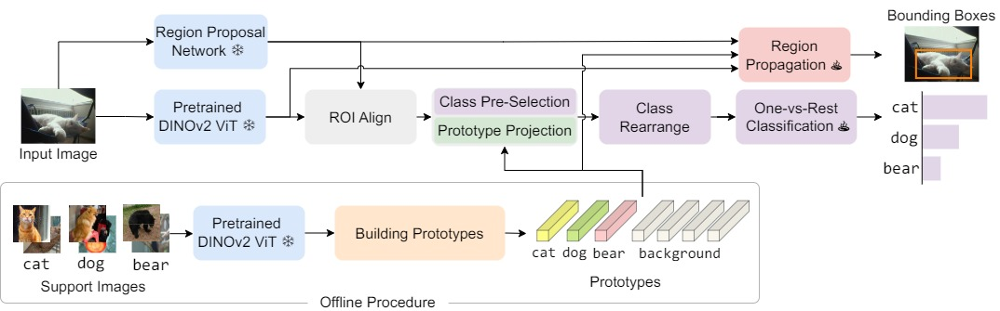

# Detect Every Thing with Few Examples

[Arxiv Paper](https://arxiv.org/abs/2309.12969)

[](https://paperswithcode.com/sota/open-vocabulary-object-detection-on-lvis-v1-0?p=detect-every-thing-with-few-examples) [](https://paperswithcode.com/sota/open-vocabulary-object-detection-on-mscoco?p=detect-every-thing-with-few-examples)  [](https://paperswithcode.com/sota/few-shot-object-detection-on-ms-coco-10-shot?p=detect-every-thing-with-few-examples)  [](https://paperswithcode.com/sota/few-shot-object-detection-on-ms-coco-30-shot?p=detect-every-thing-with-few-examples)   [](https://paperswithcode.com/sota/one-shot-object-detection-on-coco?p=detect-every-thing-with-few-examples)




We present DE-ViT, an open-set object detector in this repository.
In contrast to the popular open-vocabulary approach, we follow the few-shot formulation to represent each category with few support images rather than language. Our results shows potential for using images as category representation. 
DE-ViT establishes new state-of-the-art on open-vocabulary, few-shot, and one-shot object detection benchmark with COCO and LVIS.

## Installation

```bash
git clone https://github.com/mlzxy/devit.git
conda create -n devit  python=3.9 
conda activate devit
pip install -r devit/requirements.txt
pip install -e ./devit
```

Next, check [Downloads.md](Downloads.md) for instructions to setup datasets and model checkpoints.

## Running Scripts

Download datasets and checkpoints before running scripts.

## Demo


```bash
python3 ./demo/demo.py # will generate demo/output/ycb.out.jpg
```

The notebook [demo/build_prototypes.ipynb](demo/build_prototypes.ipynb) builds prototypes for YCB objects using ViT-L/14 and our provided example images.

## Training 

```bash
vit=l task=ovd dataset=coco bash scripts/train.sh  # train open-vocabulary COCO with ViT-L

# task=ovd / fsod / osod
# dataset=coco / lvis
# vit=s / b / l

# few-shot env var `shot = 5 / 10 / 30`
vit=l task=fsod shot=10 bash scripts/train.sh 

# one-shot env var `split = 1 / 2 / 3 / 4`
vit=l task=osod split=1 bash script/train.sh

# detectron2 options can be provided through args, e.g.,
task=ovd dataset=lvis bash scripts/train.sh MODEL.MASK_ON True # train lvis with mask head

# another env var is `num_gpus = 1 / 2 ...`, used to control
# how many gpus are used
```


## Evaluation 

All evaluations can be run without training, as long as the checkpoints are downloaded.

The script-level environment variables are the same to training.

```bash
vit=l task=ovd dataset=coco bash scripts/eval.sh # evaluate COCO OVD with ViT-L/14

vit=l task=ovd dataset=lvis bash scripts/eval.sh DE.TOPK 3  MODEL.MASK_ON True  # evaluate LVIS OVD with ViT-L/14
```


## RPN Training (COCO)

```bash
bash scripts/train_rpn.sh  ARG
# change ARG to ovd / os1 / os2 / os3 / os4 / fs14
# corresponds to open-vocabulary / one-shot splits 1-4 / few-shot
```

Check [Tools.md](Tools.md) for intructions to build prototype and prepare weights.

## Acknowledgement


This repository was built on top of [RegionCLIP](https://github.com/microsoft/RegionCLIP) and [DINOv2](https://github.com/facebookresearch/dinov2). We thank the effort from our community.


## Citation

```
@misc{zhang2023detect,
      title={Detect Every Thing with Few Examples}, 
      author={Xinyu Zhang and Yuting Wang and Abdeslam Boularias},
      year={2023},
      eprint={2309.12969},
      archivePrefix={arXiv},
      primaryClass={cs.CV}
}
```


